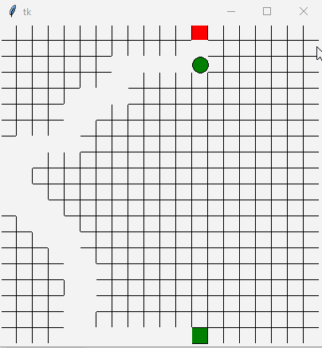

# PathChroma

<p align="center">
  
</p>

A beautiful visualization of a ball following a randomly generated path between start and end points on a grid, with color-changing effects.

## Features

- 🎨 Color-changing ball animation
- 🗺️ Random path generation on a grid
- 🕹️ Interactive visualization with Tkinter
- ⏱️ Smooth timing control with time module

## Requirements

Import the following libraries in the preferred environment to see the code in action:
```python
import python
import tkinter as tk  
import random         
import time     